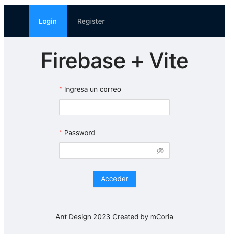

# AntDesign + Vue3 + Next + Firebase

This is a solution to test AntDesign UI. Includes the `unplugin-vue-components` to avoid insert directyl the component into the `view` and `firebase` to store the data.

## Table of contents

- [Overview](#overview)
  - [Screenshot](#screenshot)
  - [Links](#links)
- [My process](#my-process)
  - [Built with](#built-with)
  - [What I learned](#what-i-learned)
  - [Continued development](#continued-development)
  - [Useful resources](#useful-resources)
- [Author](#author)
- [Acknowledgments](#acknowledgments)

**Note: Delete this note and update the table of contents based on what sections you keep.**

## Overview

### Screenshot

### Links

- [Solution URL](https://github.com/mcoria08/vue-firebase-ant-design)
- [Live Site URL](hhttps://peppy-sunshine-42dfa9.netlify.app/login)

## My process

### Built with

- Firebase 9
- Vue3
- AntDesign UI
- Next
- Mobile-first workflow

### What I learned

How to work with AntDesign UI + Firebase.

### Continued development

Evolve to a professional front-end developer.

### Useful resources

- [Ant Design Vue](https://antdv.com/components/overview) - This helped me to understand how to work with Ant Design Vue UI.

## Author

- Website - [Miguel Coria](https://github.com/mcoria08)
- Twitter - [@miguelcoria](https://twitter.com/miguelcoria)

## Acknowledgments

Another challenge with VueJS